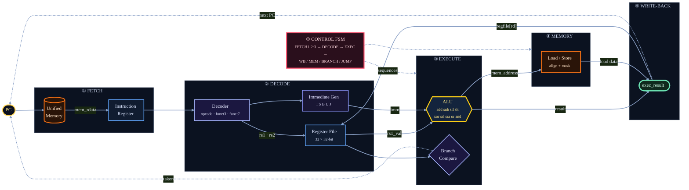

# RV32I Multi-Cycle Processor (Verilog)



<p align="center"><sub><b>The RV32I multi-cycle datapath.</b> A value flows left → right through five stages; the control FSM sequences every step, and <code>exec_result</code> is the single write-back source. Faithful to <a href="rtl/riscv_processor.sv"><code>rtl/riscv_processor.sv</code></a>.</sub></p>

## This is not the Project Report; for the full design write-up, see [project_report.md](<project_report.md>).

A from-scratch **RISC-V RV32I** processor written in Verilog/SystemVerilog for
the *DAC-102 Verilog Project*. It implements the complete RV32I base integer
instruction set (all 37 instructions) except `ecall`/`ebreak`, and exposes the
mandated memory interface so it can be driven by an automated testbench.

The synthesizable core is [rtl/riscv_processor.sv](rtl/riscv_processor.sv). A
self-checking testbench in [tb/testbench.sv](tb/testbench.sv) assembles small
RV32I programs, runs them, and checks the architectural results — **38 / 38
assertions pass**.

For the detailed micro-architecture, datapath/FSM diagrams, and verification
discussion, read [project_report.md](<project_report.md>).

## Repository Layout

```text
.
├── rtl/
│   └── riscv_processor.sv          # The RV32I CPU — top module / deliverable
├── tb/
│   └── testbench.sv                # Self-checking testbench (16 groups / 38 assertions)
├── sim/
│   ├── run.sh                      # One-command build + run (iverilog + vvp)
│   └── sim.log                     # Committed simulation transcript (38/38 pass)
├── for_generating_readme/          # Figure tooling + generated assets
│   ├── generate_figures.py         # matplotlib plots (dark theme)
│   └── *.png                       # formats, instr table, timeline, results
├── docs/
│   └── assignment_spec.pdf         # Original assignment specification
├── project_report.md               # Full project report and design logic
└── README.md
```

## Requirements

* [Icarus Verilog](https://steveicarus.github.io/iverilog/) 11+ (`iverilog`, `vvp`)
  — recommended by the assignment.
* Optional, to regenerate the report figures: Python 3.10+ with `matplotlib`.

Install on macOS / Linux:

```bash
# macOS
brew install icarus-verilog

# Debian / Ubuntu
sudo apt-get install iverilog

# optional figure dependencies
python -m pip install matplotlib
```

## Run The Testbench

From the repository root:

```bash
iverilog -g2012 -o sim/rv_sim rtl/riscv_processor.sv tb/testbench.sv
vvp sim/rv_sim
```

Or use the convenience script:

```bash
bash sim/run.sh
```

Either way you should see:

```text
============================================================
TEST SUMMARY: 38 PASSED, 0 FAILED out of 38 total
ALL TESTS PASSED!
============================================================
```

The committed transcript is at [sim/sim.log](sim/sim.log).

## Submission File

The assignment requires the top module to be named `<roll_number>_riscv.v`. That
file is committed at the repository root as
[25323045_riscv.v](25323045_riscv.v) — identical logic to
[rtl/riscv_processor.sv](rtl/riscv_processor.sv), with the module declared as an
escaped Verilog identifier (a module name starting with a digit must be written
`\25323045_riscv`). It passes the same 38/38 testbench:

```bash
iverilog -g2012 -o sim/rv_sim 25323045_riscv.v tb/testbench.sv  # see note below
```

> The bundled testbench instantiates `riscv_processor`; the automated grader
> instantiates `\25323045_riscv`. Both forms are verified equivalent.

## Optional: Regenerate Figures

All figures in `for_generating_readme/` are already committed. The dark-themed
plots (instruction formats, instruction table, execution timeline, test
results) are produced by matplotlib:

```bash
python for_generating_readme/generate_figures.py   # after a fresh sim/sim.log
```

The **hero datapath** and the **control-FSM** diagram are authored as
[Mermaid](https://mermaid.js.org) blocks directly in this README and in
[project_report.md](<project_report.md>), so they render on GitHub with no build
step.

## Method Summary

The core is a **multi-cycle** design driven by a single 11-state FSM:

```text
FETCH1 -> FETCH2 -> FETCH3 -> DECODE -> EXEC -> { WB | MEM1..3 | BRANCH | JUMP } -> FETCH1
```

`EXEC` dispatches by opcode: arithmetic / `LUI` / `AUIPC` go straight to
write-back; loads and stores walk the three-state memory sequence; branches and
jumps redirect the PC. The three-cycle fetch models the one-cycle latency of
the memory bus (assert strobe → settle → capture), and the same pattern is
reused for loads. Sub-word loads and stores are aligned and sign/zero-extended
from the two low address bits, and `x0` is hardwired to zero.

Full details — including the ALU, immediate generation, branch logic, memory
interface, and the complete verification matrix — are in
[project_report.md](<project_report.md>).
