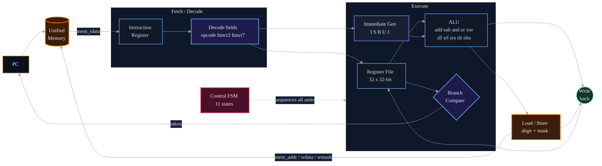
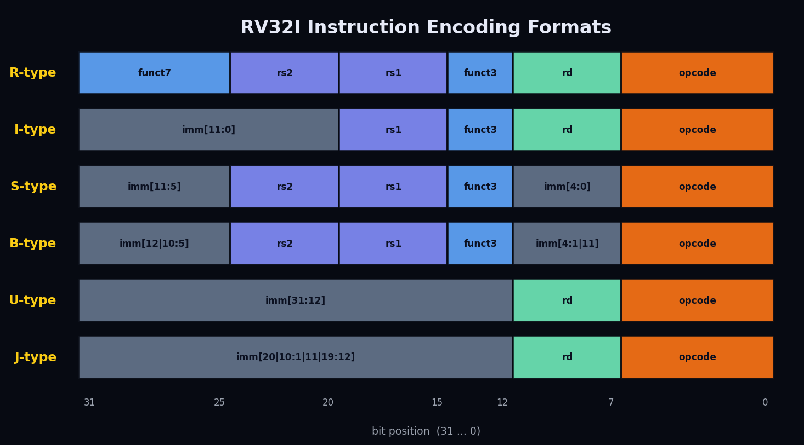
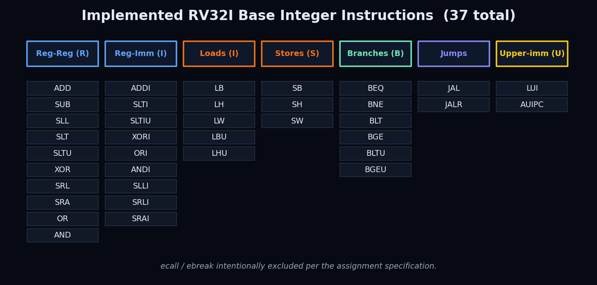
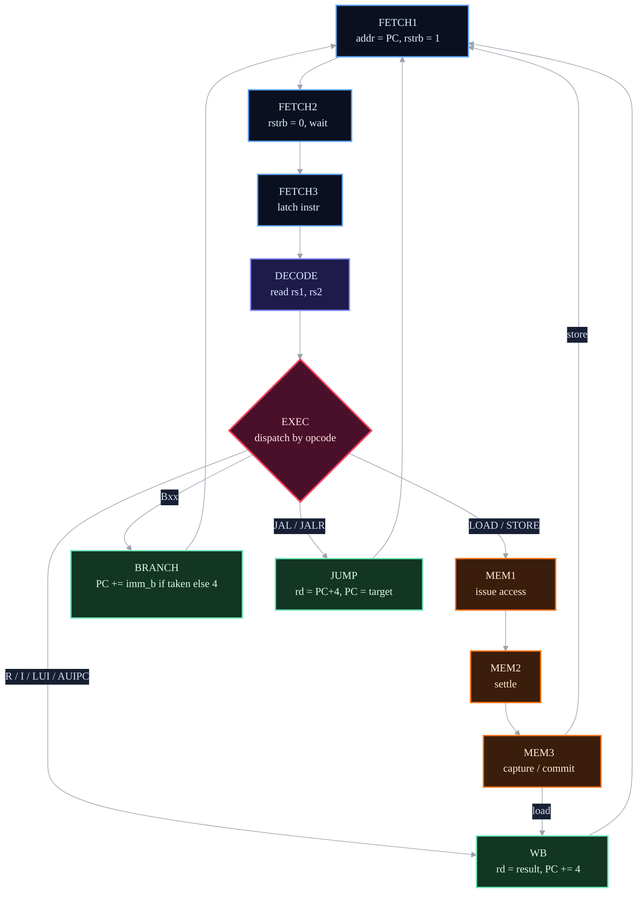
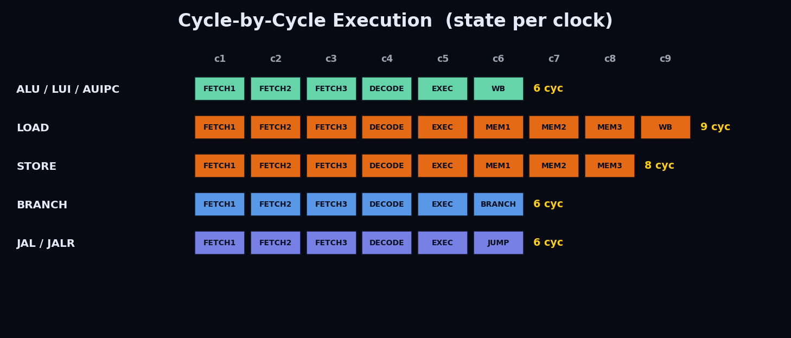
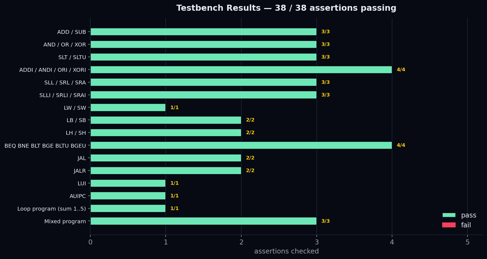

# Project Report — RV32I Multi-Cycle Processor

A from-scratch Verilog implementation of a RISC-V **RV32I** base-integer CPU,
written for the *DAC-102 Verilog Project*. The processor implements the full
RV32I user-level integer instruction set (all 37 instructions) except the
`ecall` and `ebreak` system instructions, exactly as the assignment specifies,
and exposes the mandated memory interface so it can be driven by an automated
testbench.

The single source file is [rtl/riscv_processor.sv](rtl/riscv_processor.sv). It
fetches, decodes, and executes RV32I machine code from a unified
word-addressable memory through a clean handshake of `mem_addr`, `mem_wdata`,
`mem_wmask`, `mem_rstrb`, and `mem_rdata`. A self-checking testbench
([tb/testbench.sv](tb/testbench.sv)) assembles small programs in-place and
verifies the architectural results against expected memory contents.

> This document is the detailed design report. For build and run instructions,
> see [README.md](README.md).

---

## 1. Problem Setup

The task is **not** to glue together a pre-built core, but to design the
micro-architecture that turns a 32-bit instruction word into the correct
architectural state change. Two constraints shape the entire design:

1. **Fixed interface.** Grading is automated, so the top module *must* expose
   the exact port list below. The CPU may only talk to the outside world
   through this bus.

2. **Complete RV32I behaviour.** Every base integer instruction — arithmetic,
   logic, shifts, comparisons, loads, stores, branches, jumps, and the
   upper-immediate forms — must produce bit-exact results, including correct
   sign/zero extension and sub-word memory alignment.

```verilog
module riscv_processor (
    input             clk,
    output reg [31:0] mem_addr,    // byte address of the access
    output reg [31:0] mem_wdata,   // write data
    output reg [3:0]  mem_wmask,   // per-byte write-enable strobe
    input      [31:0] mem_rdata,   // read data (valid the cycle after rstrb)
    output reg        mem_rstrb,   // read strobe
    input             mem_rbusy,   // memory busy (read)
    input             mem_wbusy,   // memory busy (write)
    input             reset        // active-low synchronous reset
);
```

I chose a **multi-cycle micro-architecture** driven by a single finite-state
machine rather than a flat single-cycle datapath. The reason is the memory
interface: reads are not combinational — `mem_rdata` is only valid the cycle
*after* `mem_rstrb` is asserted. A multi-cycle FSM lets the controller wait for
memory deterministically, reuse one memory port for both instruction fetch and
data access, and keep the critical path short, all without speculative logic.

---

## 2. Architecture Overview



The datapath is built from the classic RISC building blocks, each kept as a
small, independently testable unit:

| Block | Role |
| --- | --- |
| **PC** | 32-bit program counter; `+4` by default, redirected on taken branches and jumps. |
| **Instruction Register** | Latches the fetched word so decode fields are stable across the rest of the cycle sequence. |
| **Register File** | 32 × 32-bit registers; `x0` reads as zero and is never written. |
| **Immediate Generator** | Sign-extends the five immediate encodings (I/S/B/U/J) in parallel. |
| **ALU** | Combinational arithmetic/logic/shift/compare unit selected by `funct3`/`funct7`. |
| **Branch / Compare** | Combinational comparator producing the taken/not-taken decision for `Bxx`. |
| **Load/Store unit** | Byte/half/word alignment, sign/zero extension, and per-byte write masks. |
| **Control FSM** | 11-state controller that sequences every instruction class. |

Everything is `reg`-based and clocked off a single `posedge clk`, with an
active-low synchronous `reset` that clears the PC, the FSM state, and the whole
register file.

---

## 3. Instruction Set

All six RV32I instruction formats are decoded. The opcode (bits `6:0`) selects
the format; `funct3` and `funct7` refine the operation.



Immediates are reassembled from their scattered encodings in a single
combinational block:

```verilog
wire [31:0] imm_i = {{20{instr[31]}}, instr[31:20]};
wire [31:0] imm_s = {{20{instr[31]}}, instr[31:25], instr[11:7]};
wire [31:0] imm_b = {{19{instr[31]}}, instr[31], instr[7], instr[30:25], instr[11:8], 1'b0};
wire [31:0] imm_u = {instr[31:12], 12'b0};
wire [31:0] imm_j = {{11{instr[31]}}, instr[31], instr[19:12], instr[20], instr[30:21], 1'b0};
```

The complete set of implemented instructions:



`ecall` and `ebreak` are intentionally omitted, as permitted by the assignment.

---

## 4. Control FSM

A single FSM is the heart of the design. Each instruction walks through a
sequence of states; the path taken after `EXEC` depends on the opcode.



| State | Action |
| --- | --- |
| `FETCH1` | Drive `mem_addr = PC`, assert `mem_rstrb`. |
| `FETCH2` | De-assert `mem_rstrb`; wait for memory. |
| `FETCH3` | Latch `mem_rdata` into the instruction register. |
| `DECODE` | Read `rs1`/`rs2` from the register file (x0 forced to 0). |
| `EXEC`   | Compute the ALU result and **dispatch** by opcode. |
| `MEM1`–`MEM3` | Issue and complete a load or store on the shared bus. |
| `WB`     | Write the result back to `rd`; advance PC. |
| `BRANCH` | Apply `PC + imm_b` if the comparison is taken, else `PC + 4`. |
| `JUMP`   | Write the return address; set PC to the JAL/JALR target. |

The three-cycle fetch (`FETCH1→FETCH2→FETCH3`) models the one-cycle read
latency of the memory: the strobe is asserted, the data settles, and only then
is it captured. The same three-state read/settle/capture pattern is reused for
loads in `MEM1`–`MEM3`.

### Per-class cycle counts

Because the FSM is shared, instruction latency varies by class:



| Class | States | Cycles |
| --- | --- | --- |
| R-type, I-type ALU, `LUI`, `AUIPC` | FETCH×3 → DECODE → EXEC → WB | 6 |
| Branches (`Bxx`) | FETCH×3 → DECODE → EXEC → BRANCH | 6 |
| Jumps (`JAL`, `JALR`) | FETCH×3 → DECODE → EXEC → JUMP | 6 |
| Stores (`SB`/`SH`/`SW`) | FETCH×3 → DECODE → EXEC → MEM×3 | 8 |
| Loads (`LB…LW`) | FETCH×3 → DECODE → EXEC → MEM×3 → WB | 9 |

Every terminal state unconditionally returns to `FETCH1`, so the controller can
never deadlock — there is exactly one entry point and every path leads back to
it.

---

## 5. Datapath Details

### 5.1 ALU

The ALU is purely combinational and shared by R-type and I-type instructions.
Its second operand is `rs2` for register-register ops and the I-immediate
otherwise. `funct3` selects the operation; `funct7[5]` distinguishes
`ADD`/`SUB` and `SRL`/`SRA`.

```verilog
3'b000: alu_result = (opcode == OP_RTYPE && funct7[5]) ? alu_a - alu_b : alu_a + alu_b;
3'b001: alu_result = alu_a << alu_b[4:0];                       // SLL / SLLI
3'b010: alu_result = ($signed(alu_a) < $signed(alu_b)) ? 1 : 0; // SLT / SLTI
3'b011: alu_result = (alu_a < alu_b) ? 1 : 0;                   // SLTU / SLTIU
3'b100: alu_result = alu_a ^ alu_b;                             // XOR
3'b101: alu_result = funct7[5] ? ($signed(alu_a) >>> alu_b[4:0])// SRA / SRAI
                               : (alu_a >> alu_b[4:0]);         // SRL / SRLI
3'b110: alu_result = alu_a | alu_b;                             // OR
3'b111: alu_result = alu_a & alu_b;                             // AND
```

Signed comparisons and arithmetic right-shifts use `$signed`, so `SLT`/`SLTI`
and `SRA`/`SRAI` behave correctly on negative operands — verified explicitly in
tests 3, 5, and 6.

### 5.2 Branch comparator

A second combinational block evaluates the six branch conditions from `funct3`,
mixing signed (`BLT`/`BGE`) and unsigned (`BLTU`/`BGEU`) comparisons:

```verilog
3'b000: branch_taken = (rs1_val == rs2_val);              // BEQ
3'b001: branch_taken = (rs1_val != rs2_val);              // BNE
3'b100: branch_taken = ($signed(rs1_val) < $signed(rs2_val)); // BLT
3'b101: branch_taken = ($signed(rs1_val) >= $signed(rs2_val));// BGE
3'b110: branch_taken = (rs1_val < rs2_val);               // BLTU
3'b111: branch_taken = (rs1_val >= rs2_val);              // BGEU
```

### 5.3 Load alignment and extension

The memory is word-addressed, so sub-word loads must select and extend the
correct bytes using the two low address bits. The combinational load unit
covers `LB`, `LH`, `LW`, `LBU`, and `LHU`, choosing sign- or zero-extension by
`funct3`:

```verilog
3'b000: load_data = sign_extend_byte(mem_rdata, byte_offset);  // LB
3'b001: load_data = sign_extend_half(mem_rdata, byte_offset);  // LH
3'b010: load_data = mem_rdata;                                 // LW
3'b100: load_data = zero_extend_byte(mem_rdata, byte_offset);  // LBU
3'b101: load_data = zero_extend_half(mem_rdata, byte_offset);  // LHU
```

### 5.4 Store alignment and masking

Stores shift the source register into the correct byte lanes and produce a
per-byte write mask so memory only updates the addressed bytes. For example a
byte store at offset 2 yields `store_mask = 4'b0100` and the data shifted left
16 bits. `SH` produces `4'b0011`/`4'b1100`; `SW` produces `4'b1111`. The
testbench's memory model honours this mask bit-by-bit, so any mask error shows
up immediately.

### 5.5 Register file and PC redirection

`x0` is handled in two places: reads of register 0 return a literal zero, and
the writeback stages skip the write when `rd == 0`. PC redirection lives in the
terminal states — `WB`/`MEM3` advance by 4, `BRANCH` conditionally adds
`imm_b`, `JUMP` adds `imm_j` for `JAL` or computes `(rs1 + imm_i) & ~1` for
`JALR` (clearing the low bit as the spec requires).

---

## 6. Memory Interface

The CPU drives one shared, byte-addressed bus for both instruction fetch and
data access:

* **Reads** assert `mem_rstrb` for one cycle; `mem_rdata` is sampled on the
  following cycle. Addresses are word-aligned with `{addr[31:2], 2'b00}` and
  sub-word selection happens in the load unit.
* **Writes** present `mem_wdata` together with a one-cycle `mem_wmask` strobe;
  the mask is cleared immediately afterwards so a store never lingers on the
  bus.

The `mem_rbusy` / `mem_wbusy` inputs are part of the mandated interface for
memories that can stall; this design targets the zero-wait-state model used by
the reference testbench, so the FSM's fixed read/settle/capture sequence is
sufficient. Extending the controller to spin in `FETCH2`/`MEM2` while a busy
line is high is the natural next step (see §9).

---

## 7. Verification

### 7.1 Methodology

The self-checking testbench in [tb/testbench.sv](tb/testbench.sv) takes a
black-box, results-oriented approach:

1. A behavioural memory model implements the same `rstrb`/`wmask` handshake the
   CPU expects, including per-byte write masking.
2. Helper functions (`rv_rtype`, `rv_itype`, … `rv_jtype`) **assemble** RV32I
   machine code from fields, so each test reads like assembly.
3. Each test loads a tiny program, releases reset, waits for the program's
   store(s) to land in memory (`wait_store`), and a `check` task compares the
   stored word against the expected value, tallying pass/fail.
4. A 1 ms watchdog `$finish`es the simulation if a program ever hangs.

This validates *architectural* behaviour — the values a program actually
computes and writes back — rather than internal signals, which keeps the tests
robust to micro-architectural changes.

### 7.2 Results

The suite covers all instruction classes across 16 test groups and 38
assertions, and every one passes:



```text
============================================================
TEST SUMMARY: 38 PASSED, 0 FAILED out of 38 total
ALL TESTS PASSED!
============================================================
```

Coverage highlights:

* **Arithmetic/logic/shift** — `ADD/SUB`, `AND/OR/XOR`, `SLL/SRL/SRA` and the
  immediate variants, including negative operands and arithmetic right shifts.
* **Comparisons** — signed vs. unsigned (`SLT` vs. `SLTU`) with a negative
  value.
* **Memory** — `LW/SW`, plus sub-word `LB/SB` and `LH/SH` at non-zero byte
  offsets to exercise alignment and extension.
* **Control flow** — all six branch conditions, `JAL`, and `JALR`.
* **Upper immediates** — `LUI` and `AUIPC`.
* **Integration** — a counted loop summing 1…5 (= 15) and a mixed program that
  chains arithmetic, a shift, a store, a load, a branch, and `LUI`/`ORI`.

The full transcript is committed at [sim/sim.log](sim/sim.log).

---

## 8. Design Decisions and Alternatives

**Multi-cycle FSM over single-cycle.** A flat single-cycle core would need the
instruction and data to be available combinationally in the same cycle. The
mandated interface makes reads one-cycle-latent, so a single-cycle design would
have required a separate combinational instruction memory and a different data
path — diverging from the provided interface. The FSM models the real bus
handshake honestly and reuses one memory port for fetch and data.

**Combinational ALU / branch / align units with registered control.** Keeping
the arithmetic purely combinational and gating it with FSM-sequenced registers
made each block trivial to reason about and test in isolation, and keeps the
clocked logic confined to one `always @(posedge clk)` block.

**Field-assembling testbench helpers.** Hand-encoding 32-bit instructions is
error-prone. Building `rv_*` functions that pack fields turned the tests into
readable pseudo-assembly and removed an entire class of "wrong test vector"
bugs.

---

## 9. Future Improvements

* **Wait-state support.** Honour `mem_rbusy`/`mem_wbusy` by stalling in the
  fetch/memory wait states, enabling slower or cached memories.
* **Cycle reduction.** Collapse the three-cycle fetch to two (or one with a
  combinational instruction memory) to cut per-instruction latency.
* **Pipelining.** Evolve the multi-cycle datapath into a classic 5-stage
  pipeline with forwarding and hazard detection for higher throughput.
* **CSR + traps.** Add the machine-mode CSRs and `ecall`/`ebreak` handling to
  move toward a bootable RV32I core.
* **Coverage.** Add randomized/constrained-random instruction streams and a
  golden-model co-simulation for exhaustive checking.

---

## 10. Directory Structure

```text
.
├── rtl/
│   └── riscv_processor.sv      # the RV32I CPU (top module / deliverable)
├── tb/
│   └── testbench.sv            # self-checking testbench, 16 groups / 38 assertions
├── sim/
│   ├── run.sh                  # one-command build + run (iverilog + vvp)
│   └── sim.log                 # committed simulation transcript (38/38 pass)
├── for_generating_readme/
│   ├── generate_figures.py     # regenerates the dark-themed raster figures
│   └── *.png                   # formats, instruction table, timeline, results
│                               # (datapath + FSM are Mermaid blocks inline)
├── docs/
│   └── assignment_spec.pdf     # original assignment specification
├── project_report.md           # this report
└── README.md                   # build/run instructions and overview
```
